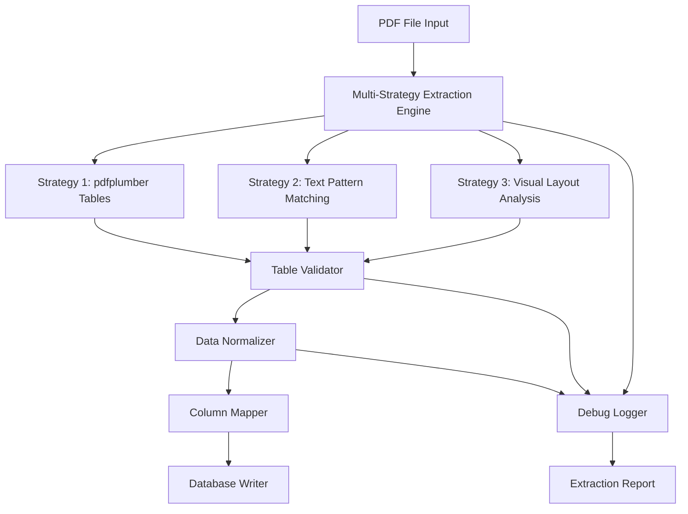

# PDF Data Extraction Analysis & Improvement Plan

## Current Issues
Based on the code review and reported issue: "The extraction detects 0 transactions even though the PDF contains data"

### Key Problems Identified

1. **Rigid Pattern Matching**: The `_parse_text_based_tables` method uses `r'^\d{8}'` regex pattern, expecting lines to start with exactly 8 digits. This is likely too restrictive.

2. **Fixed Column Boundaries**: The extraction assumes fixed character positions for columns, which may not match the actual PDF layout.

3. **Fallback-Only Text Parsing**: Text-based parsing only happens when pdfplumber fails to find tables, potentially missing hybrid formats.

4. **No Debugging Output**: Limited visibility into what's happening during extraction makes troubleshooting difficult.

## Proposed Solution Architecture



## Detailed Improvement Plan

### Phase 1: Diagnostic Tools
Create comprehensive debugging capabilities to understand the PDF structure:

1. **PDF Structure Analyzer**
   - Extract and analyze raw text from each page
   - Identify table boundaries and structures
   - Log character positions and patterns
   - Generate visual representation of data layout

2. **Pattern Discovery Tool**
   - Analyze first few characters of each line
   - Identify common patterns for data rows
   - Detect column separators and alignments
   - Build pattern library for different report formats

### Phase 2: Robust Extraction Engine

1. **Multi-Pattern Row Detection**
   ```python
   # Example patterns to try:
   patterns = [
       r'^\d{8}',           # 8-digit ticket number
       r'^\d{6,10}',        # Flexible digit count
       r'^\d+\s+\w+',       # Number followed by text
       r'^[A-Z0-9]{5,}',    # Alphanumeric codes
       r'^\d{2}/\d{2}/\d{4}' # Date patterns
   ]
   ```

2. **Adaptive Column Detection**
   - Analyze header rows to detect column positions dynamically
   - Use visual spacing to identify column boundaries
   - Support variable-width columns
   - Handle wrapped text and multi-line cells

3. **Hybrid Extraction Strategy**
   - Try multiple extraction methods in parallel
   - Score results based on data quality metrics
   - Combine best results from different strategies
   - Fall back gracefully when methods fail

### Phase 3: Data Validation & Mapping

1. **Smart Column Mapping**
   - Fuzzy matching for column headers
   - Handle variations in column names
   - Support column reordering
   - Detect missing or extra columns

2. **Data Type Validation**
   - Verify expected data types per column
   - Handle date format variations
   - Normalize numeric values
   - Clean and standardize text fields

3. **Row-Level Validation**
   - Check for required fields
   - Validate relationships between fields
   - Identify and handle partial rows
   - Flag suspicious data for review

### Phase 4: Error Handling & Recovery

1. **Graceful Degradation**
   - Continue processing even with partial failures
   - Log all issues for manual review
   - Provide clear error messages
   - Suggest corrective actions

2. **Manual Override Options**
   - Allow custom pattern definitions
   - Support manual column mapping
   - Enable data correction interface
   - Provide extraction preview

## Implementation Roadmap

### Step 1: Create Diagnostic Suite
- Build PDF analyzer tool
- Implement comprehensive logging
- Create test harness with sample PDFs
- Generate extraction reports

### Step 2: Enhance Row Detection
- Implement multi-pattern matching
- Add configurable pattern library
- Create pattern learning mechanism
- Test with various PDF formats

### Step 3: Improve Column Handling
- Build dynamic column detector
- Implement fuzzy header matching
- Add column position calculator
- Handle complex table layouts

### Step 4: Add Validation Layer
- Create data type validators
- Build column mapping engine
- Implement row validators
- Add data cleaning functions

### Step 5: Production Readiness
- Add performance optimizations
- Implement caching mechanisms
- Create monitoring dashboards
- Write comprehensive documentation

## Testing Strategy

1. **Unit Tests**
   - Test each extraction method independently
   - Verify pattern matching accuracy
   - Validate column detection logic
   - Check data type conversions

2. **Integration Tests**
   - Test full extraction pipeline
   - Verify database writes
   - Check data integrity
   - Validate error handling

3. **Regression Tests**
   - Build test suite with known PDFs
   - Track extraction accuracy over time
   - Monitor performance metrics
   - Ensure backward compatibility

## Success Metrics

- **Extraction Rate**: >95% of rows successfully extracted
- **Column Accuracy**: >99% correct column mapping
- **Processing Speed**: <5 seconds per PDF page
- **Error Recovery**: Graceful handling of 100% of errors

## Next Steps

1. Review and approve this plan
2. Prioritize implementation phases
3. Allocate resources and timeline
4. Begin with diagnostic tool development
5. Iterate based on findings