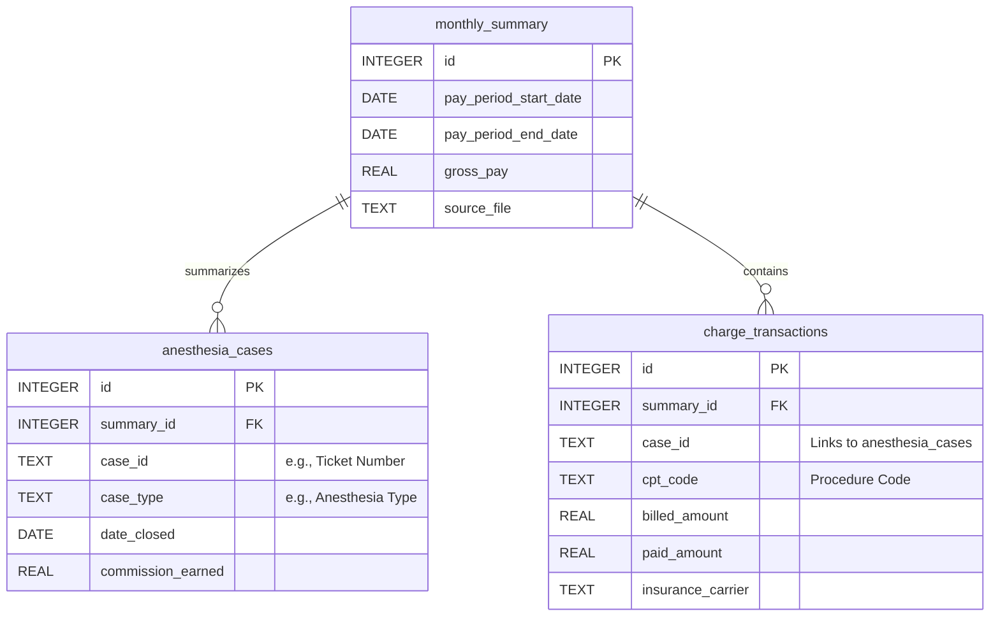

# Project: Automated Anesthesia Compensation & Practice Analysis Pipeline (Revised)

**Project Goal:** To create a secure, consolidated database of compensation and operational data from monthly reports to track income, analyze practice metrics, and ensure data privacy.

---

### **Phase 1: Environment Setup**

This phase ensures your project has a clean, isolated, and reproducible environment.

**Strategy:**
We will use a virtual environment to manage project dependencies, preventing conflicts with other Python projects.

**Instructions:**

1.  **Install Python:** Ensure you have Python 3.8 or newer installed.
2.  **Create Project Directory:**
    ```bash
    mkdir compensation_analyzer
    cd compensation_analyzer
    ```
3.  **Create a Virtual Environment:**
    ```bash
    python3 -m venv venv
    ```
4.  **Activate the Virtual Environment:**
    *   On macOS/Linux: `source venv/bin/activate`
    *   On Windows: `.\venv\Scripts\activate`
5.  **Install Required Libraries:** Create a file named `requirements.txt` and add the following lines:
    ```
    pandas
    sqlalchemy
    pdfplumber
    matplotlib
    seaborn
    ```
6.  **Install from `requirements.txt`:**
    ```bash
    pip install -r requirements.txt
    ```

---

### **Phase 2: Data Extraction Logic (ETL) (Revised)**

**Strategy:**
The extraction script is now more sophisticated. It must identify and differentiate between three distinct sections within each PDF:
1.  The Compensation Summary.
2.  The `ChargeTransaction` table(s).
3.  The `Ticket Tracking Report` table(s).

We will use `pdfplumber` to find tables on each page and inspect their headers or surrounding text to identify them correctly. For example, we'll look for a table that appears immediately after the text "ChargeTransaction Report".

**Revised Code Strategy:**

```python
import pdfplumber
import pandas as pd
import re

def extract_data_from_medical_report(file_path):
    """
    Extracts three distinct data sets from a single medical compensation PDF.
    """
    with pdfplumber.open(file_path) as pdf:
        # 1. Extract Summary Data (Logic remains similar)
        # ...
        
        # 2. Extract Specific Tables by Identifying Headers
        charge_transaction_dfs = []
        ticket_tracking_dfs = []
        
        for page in pdf.pages:
            full_text = page.extract_text()
            tables = page.extract_tables()
            
            # Identify tables based on text found on the page
            if "ChargeTransaction Report" in full_text:
                # Assume tables on this page belong to this report
                for table in tables:
                    charge_transaction_dfs.append(pd.DataFrame(table[1:], columns=table[0]))

            if "Ticket Tracking Report" in full_text:
                for table in tables:
                    ticket_tracking_dfs.append(pd.DataFrame(table[1:], columns=table[0]))

        # Consolidate multi-page tables
        charge_transactions = pd.concat(charge_transaction_dfs, ignore_index=True) if charge_transaction_dfs else pd.DataFrame()
        ticket_tracking = pd.concat(ticket_tracking_dfs, ignore_index=True) if ticket_tracking_dfs else pd.DataFrame()

        # IMPORTANT: Anonymize data by dropping the patient name column immediately
        if 'Patient Name' in charge_transactions.columns:
            charge_transactions = charge_transactions.drop(columns=['Patient Name'])
        if 'Patient Name' in ticket_tracking.columns:
            ticket_tracking = ticket_tracking.drop(columns=['Patient Name'])
            
    # The function will now return three objects
    return summary_data, charge_transactions, ticket_tracking
```

---

### **Phase 3: Database Design & Population (Revised)**

**Strategy:**
We will expand the database schema. The `case_details` table will be renamed to `anesthesia_cases` for clarity and will **exclude any patient name column**. We will add a new table, `charge_transactions`, to store the data from that report. Both tables will link back to the `monthly_summary`.

**Revised Database Schema (Mermaid Diagram):**



---

### **Phase 4: Batch Processing & Historical Load (Revised)**

**Strategy:**
The script logic remains the same, but the call to the extraction and population functions will be updated to handle the three separate data structures. The error handling strategy is even more important now due to the increased complexity of the files.

---

### **Phase 5: Data Analysis & Insights (Revised)**

**Strategy:**
The analysis questions are updated to reflect the new data available and the removal of patient-specific information.

**Revised Analytical Questions:**

1.  **Income Trend:** How has my total monthly `gross_pay` trended over time? (Same as before, still valuable).
2.  **Procedure Profitability:** What are the most frequently billed CPT codes, and what is the average amount paid for each?
    *   **Analysis:** SQL query on the `charge_transactions` table.
        ```sql
        SELECT cpt_code, COUNT(id) as frequency, AVG(paid_amount) as avg_payment
        FROM charge_transactions
        GROUP BY cpt_code
        ORDER BY frequency DESC;
        ```
    *   **Visualization:** A combination bar chart (frequency) and line chart (avg_payment).
3.  **Payer Performance:** Which insurance carriers have the highest total payments, and what is their average payment per transaction?
    *   **Analysis:** SQL query grouping by `insurance_carrier`.
        ```sql
        SELECT insurance_carrier, SUM(paid_amount) as total_paid, AVG(paid_amount) as avg_paid
        FROM charge_transactions
        GROUP BY insurance_carrier
        ORDER BY total_paid DESC;
        ```
    *   **Visualization:** A horizontal bar chart.
4.  **Seasonality:** Is there a seasonal trend in the number of cases or total billed amounts? (Similar to before, but can now be done on case volume or billed amounts).
5.  **Commission Correlation:** What is the correlation between the total amount billed in a month and the total commission I earned?
    *   **Analysis:** Join `monthly_summary` with an aggregate of `charge_transactions`.
        ```sql
        SELECT s.total_commission, SUM(t.billed_amount) as total_billed
        FROM monthly_summary s
        JOIN charge_transactions t ON s.id = t.summary_id
        GROUP BY s.id;
        ```
    *   **Visualization:** A scatter plot with a regression line.

---

### **Phase 6: Automation & Maintenance**

**Strategy:**
The goal is to make the monthly update process as simple as possible.

1.  **Monthly Process:** Once a month, when you receive your new compensation report, save it to your designated data folder.
2.  **Run the Script:** Execute the main Python script from Phase 4. It will automatically pick up the new file, process it, and add the data to your SQLite database.
3.  **Archiving:** The script should be configured to move successfully processed files to an `archive` sub-directory. This prevents re-processing and keeps your main data folder clean.
4.  **Backup:** Since SQLite is a single file (`compensation.db`), backing up your data is as simple as copying this file to a safe location (e.g., cloud storage) periodically.