# Robust PDF Extraction Implementation Plan

## Overview
This document provides a detailed implementation plan for creating a robust PDF extraction system for the ChargeTransaction & Ticket Tracking Report (F3) from compensation reports.

## Implementation Structure

```mermaid
graph TB
    subgraph "Phase 1: Diagnostic Suite"
        A1[pdf_analyzer.py] --> A2[pattern_discovery.py]
        A2 --> A3[extraction_debugger.py]
        A3 --> A4[diagnostic_report.html]
    end
    
    subgraph "Phase 2: Extraction Engine"
        B1[extraction_strategies.py] --> B2[column_detector.py]
        B2 --> B3[hybrid_extractor.py]
        B3 --> B4[extraction_results.json]
    end
    
    subgraph "Phase 3: Validation Layer"
        C1[column_mapper.py] --> C2[data_validators.py]
        C2 --> C3[data_cleaner.py]
        C3 --> C4[validated_data.csv]
    end
    
    subgraph "Phase 4: Integration"
        D1[enhanced_data_extractor.py] --> D2[extraction_monitor.py]
        D2 --> D3[error_handler.py]
        D3 --> D4[extraction_logs/]
    end
```



## Detailed Implementation Tasks

### Phase 1: Diagnostic Suite (Week 1)

#### 1.1 Create `pdf_analyzer.py`
```python
# Core functionality:
- Extract raw text from each page
- Identify table structures using multiple methods
- Generate character position maps
- Create visual layout representations
- Output detailed analysis reports
```

#### 1.2 Create `pattern_discovery.py`
```python
# Core functionality:
- Analyze line patterns across all pages
- Build pattern library for different row types
- Identify column separators and alignments
- Generate pattern confidence scores
- Create pattern recommendation engine
```

#### 1.3 Create `extraction_debugger.py`
```python
# Core functionality:
- Step-through extraction process
- Visualize extraction decisions
- Log all pattern matches and failures
- Generate debug reports with recommendations
- Create interactive debugging interface
```

#### 1.4 Create diagnostic web interface
- HTML template for viewing analysis results
- Interactive pattern testing interface
- Visual representation of PDF structure
- Export functionality for debug data

### Phase 2: Enhanced Extraction Engine (Week 2)

#### 2.1 Create `extraction_strategies.py`
```python
# Implement multiple extraction strategies:
class PDFPlumberTableStrategy:
    """Use pdfplumber's table detection"""
    
class TextPatternStrategy:
    """Use regex patterns for row detection"""
    
class VisualLayoutStrategy:
    """Use spatial analysis for column detection"""
    
class TabularDataStrategy:
    """Use tabula-py as alternative"""
    
class HybridStrategy:
    """Combine multiple strategies"""
```

#### 2.2 Create `column_detector.py`
```python
# Core functionality:
- Dynamic column boundary detection
- Header row analysis and mapping
- Column width calculation
- Multi-line cell handling
- Column alignment detection
```

#### 2.3 Create `hybrid_extractor.py`
```python
# Core functionality:
- Strategy orchestration
- Result scoring and selection
- Fallback handling
- Performance optimization
- Caching mechanisms
```

### Phase 3: Data Validation & Mapping (Week 3)

#### 3.1 Create `column_mapper.py`
```python
# Core functionality:
- Fuzzy matching for column headers
- Column alias management
- Dynamic mapping rules
- Column reordering support
- Missing column handling
```

#### 3.2 Create `data_validators.py`
```python
# Validation rules for each field type:
class TicketValidator:
    """Validate ticket reference formats"""
    
class DateValidator:
    """Handle multiple date formats"""
    
class AmountValidator:
    """Validate and normalize monetary values"""
    
class TimeValidator:
    """Validate time formats and durations"""
```

#### 3.3 Create `data_cleaner.py`
```python
# Core functionality:
- Remove extra whitespace
- Fix encoding issues
- Normalize date formats
- Convert data types
- Handle special characters
```

### Phase 4: Production Integration (Week 4)

#### 4.1 Refactor `data_extractor.py`
- Integrate new extraction engine
- Maintain backward compatibility
- Add configuration options
- Implement feature flags
- Add performance monitoring

#### 4.2 Create `extraction_monitor.py`
```python
# Core functionality:
- Real-time extraction monitoring
- Success/failure metrics
- Performance tracking
- Alert generation
- Dashboard integration
```

#### 4.3 Create `error_handler.py`
```python
# Core functionality:
- Centralized error handling
- Error categorization
- Recovery strategies
- User notifications
- Error report generation
```

#### 4.4 Update web interface
- Add extraction configuration page
- Create pattern management interface
- Add manual override options
- Implement extraction preview
- Create monitoring dashboard

## Configuration Files

### `extraction_config.yaml`
```yaml
extraction:
  strategies:
    - name: pdfplumber_tables
      enabled: true
      priority: 1
    - name: text_patterns
      enabled: true
      priority: 2
    - name: visual_layout
      enabled: true
      priority: 3
  
  patterns:
    ticket_patterns:
      - pattern: '^\d{8}'
        name: "8-digit ticket"
      - pattern: '^\d{6,10}'
        name: "Variable digit ticket"
      - pattern: '^[A-Z0-9]{5,}'
        name: "Alphanumeric ticket"
    
  validation:
    strict_mode: false
    allow_partial: true
    min_confidence: 0.8
```

### `column_mappings.json`
```json
{
  "standard_mappings": {
    "Phys Ticket Ref#": ["Ticket", "Ticket Ref", "Phys", "Case #"],
    "CPT Code": ["CPT", "Procedure Code", "Code"],
    "Date of Service": ["DOS", "Service Date", "Date"],
    "Chg Amt": ["Amount", "Charge", "Total", "Charge Amount"]
  },
  "custom_mappings": {}
}
```

## Testing Strategy

### Unit Tests
- `tests/test_pdf_analyzer.py`
- `tests/test_pattern_discovery.py`
- `tests/test_extraction_strategies.py`
- `tests/test_validators.py`

### Integration Tests
- `tests/test_full_extraction.py`
- `tests/test_error_recovery.py`
- `tests/test_performance.py`

### Test Data
- `tests/data/sample_pdfs/`
- `tests/data/expected_results/`
- `tests/data/edge_cases/`

## Deployment Plan

### Step 1: Development Environment
- Set up feature branch
- Configure test environment
- Prepare sample PDFs
- Set up monitoring tools

### Step 2: Staged Rollout
- Deploy diagnostic tools first
- Test with limited PDF set
- Deploy extraction engine
- Monitor and tune performance
- Full production deployment

### Step 3: Documentation
- User guide for configuration
- Troubleshooting guide
- API documentation
- Performance tuning guide

## Success Criteria

1. **Extraction Accuracy**
   - >95% of transactions extracted successfully
   - <1% false positives
   - 100% critical field accuracy (ticket #, amounts, dates)

2. **Performance**
   - <5 seconds per PDF page
   - <30 seconds for full report
   - Memory usage <500MB per PDF

3. **Reliability**
   - 100% graceful error handling
   - No data loss on failures
   - Clear error messages

4. **Maintainability**
   - Comprehensive logging
   - Self-documenting code
   - Easy configuration updates
   - Clear debugging tools

## Next Steps

1. Review and approve this implementation plan
2. Set up development environment
3. Begin Phase 1 implementation
4. Schedule weekly progress reviews
5. Prepare test data sets

Would you like to proceed with this implementation plan or make any adjustments?